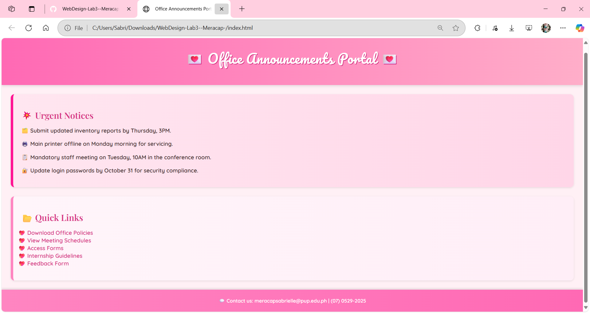

# Screenshot of the redesigned homepage

# What color choices did you make and why?

For this homepage mock-up, I selected a palette consisting of soft pinks and beige tones. These colors were chosen to convey a sense of warmth and approachability. The combination reflects my personal style while ensuring that the overall layout maintains clarity and readability throughout the homepage.

# How did you apply accessibility and fixes?

I made sure the text had enough contrast against the background, increased font sizes for better readability, and grouped content into clear sections. I also used light-colored panels to help users focus on each part of the homepage without getting overwhelmed.

# What challenges did you face?

One of the main challenges was balancing creativity with readability. I wanted the design to be colorful without becoming overwhelming. I also had difficulty with uploading and properly displaying the screenshot within the README file. Through careful troubleshooting and step-by-step guidance, I was able to resolve these issues and complete the task.
